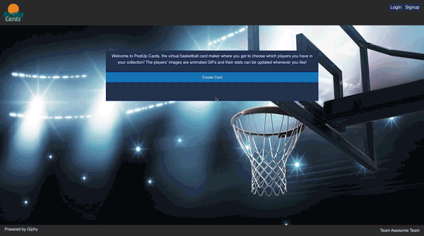

<h1 align="center">PostUp Cards</h1>

Virtual Card Collecting Fun!

# Pitch
--------------------------------------
PostUp Cards lets the user build their own deck of virtual NBA player cards that they can access online.

# User Story
--------------------------------------
As a kid, I used to love collecting sports cards. You could look at your favourite players stats quickly and have that info close at hand. However, a card collection takes space and is hard to keep with you at all times. What if you could create a digital form of sports cards made to your specific request?

# Built With
---------------------------------------
* HTML5, CSS3, JavaScript
* Handlebars
* Node
* Express
* MySql
* Sequelize

# API used
----------------------------------------
* Ball Don't Lie
* Giphy

# Get Started
-----------------------------------------

# Deployment

Heroku
https://postup-cards.herokuapp.com/

GitHub
https://github.com/JoshFrechette/PostUp-Cards.git

# Team

* Shaili Shah
    - Role: API calls
    - Portfolio:

* Gavin Wimalachandran 
    - Role: Front End - Handlebars.js, 
    - Portfolio: https://gavin-wimalachandran.netlify.com

* Khalil Mouna
    - Role: Deployment and Testing, 
    - Portfolio:

* Josh Fréchette
    - Role: Project Manager, Sequelize and Database functions
    - Portfolio: https://joshfdesign-react-portfolio.herokuapp.com/
